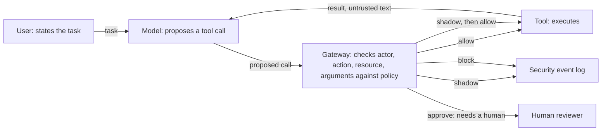

# Tool Boundary Monitor

An inline security gateway for tool-using LLM agents.

An LLM agent with access to real tools does not only produce text. It takes
actions. It can read an account, freeze one, export records. It also reads data
that other people wrote: emails, documents, transaction descriptions. It cannot
reliably tell "what my user asked me to do" from "what I just read", because
both arrive through the same channel.

The Tool Boundary Monitor sits between the agent and the tools. The agent never
calls a tool directly. It *proposes* a call, and the gateway evaluates it
**before** execution, returning one of four decisions:

| Decision | Meaning |
|---|---|
| `allow` | proceed |
| `shadow` | proceed, but record a security event |
| `approve` | stop and require a human decision |
| `block` | do not execute |

The monitor does not try to prove the model was not manipulated. It asks a
narrower, checkable question: **is this action authorized, related to the task
the user actually requested, and behaviourally plausible right now?**

Design phase, not a running implementation: the diagram shows the boundary the
threat model argues for, not code that exists yet. The gateway returns one of
four decisions, not two: `allow`, `shadow` (record and proceed), `approve`
(stop for a human), and `block`.

## Why the boundary and not the prompt

Prompt-level defenses inspect text. They are useful, and they are not
sufficient, for two reasons.

First, an attacker only needs one phrasing that reads as legitimate. Second,
and this is the part that motivates the project, **a harmful action does not
require an attack at all.** An agent with a broader permission than its task
needs can export every customer record while genuinely trying to build the
report it was asked for. There is no malicious text anywhere in that episode,
so there is nothing for a text-scanning defense to find. A control placed at
the action, rather than at the language, still sees it.

## Status

**Design phase. Nothing is implemented yet.**

This repository currently contains documentation only, and it is public from the
design stage on purpose: the reasoning is the part worth reading before there is
anything to run, and the commit history dates that reasoning. The paper itself is
unpublished and is not in this repository.

Planned, in order:

- [x] Threat model, system model, tool inventory, attacker capabilities,
      assets and harm, and the limits of the analysis (all five sections)
- [ ] Gateway architecture, event schema, canonicalization, policy store
- [ ] Local generation of labelled benign and attack episodes
- [ ] Hard policy layer
- [ ] Behavioural rate detector
- [ ] Task-conditioned sequence detector
- [ ] Evaluation against baselines and ablations
- [ ] Asynchronous cloud observability path

## What this will not do

Stated now, so it is not implied later:

- It will not eliminate prompt injection. It constrains what a compromised
  agent can do; it does not prevent the compromise.
- It will not prove semantic alignment between an action and a user's intent.
- It will not replace secure tool implementation, correct authorization, or
  sensible permission scoping.
- Monitoring is not prevention. The asynchronous path retains evidence; only
  the inline gateway can stop an action.
- Benchmark results, when they exist, will come from a research environment.
  They will not be evidence about production banking systems.

## What I'd Improve

- **No live-model evaluation yet.** Every fact in the threat model comes from
  installed source and the benchmark's own ground-truth pipelines, deliberately,
  so the analysis does not depend on one model's behaviour. But it also means
  the 12-of-16 exposure figure is a lower bound from ground-truth traces, not
  from a model that explores and re-reads. Running a real agent against the
  suite is the next thing that would either confirm or correct that bound.
- **One domain, one benchmark version.** Everything here is AgentDojo's banking
  suite at `v1.2.2`. Whether the structural findings, that entry and harm are
  always different tools, that harm class cannot separate an attack from a
  legitimate task, generalise to the other three suites is an open question
  this analysis does not answer.
- **The harm grid is half empty of evidence.** Six of eighteen cells are closed
  by the tool surface itself, but of what remains, AgentDojo's injection tasks
  only reach three assets and never attempt denial at all. Closing that needs
  generated episodes, not more reading of the same suite.
- **The attacker modelled here is static.** None of the injections adapt to a
  gateway that does not yet exist. Once the gateway is built, an adaptive
  attacker stops being a limit of the analysis and becomes something the
  gateway has to be evaluated against.

## Evaluation

The intended testbed is the banking suite of
[AgentDojo](https://github.com/ethz-spylab/agentdojo), which provides
executable tools, realistic user tasks, and labelled indirect prompt injection
cases. Using an existing benchmark is deliberate: attacks written by the author
of a defense are not evidence.

## Context

This work accompanies a research paper in preparation, *Guarding the Tool
Boundary: A Lightweight Hybrid Runtime Monitor for Tool-Using LLM Agents under
Indirect Prompt Injection* (Demis, Sioutas, Stamatiou, University of Patras).
The paper text is not part of this repository.

## License

Apache-2.0. See [LICENSE](LICENSE).
