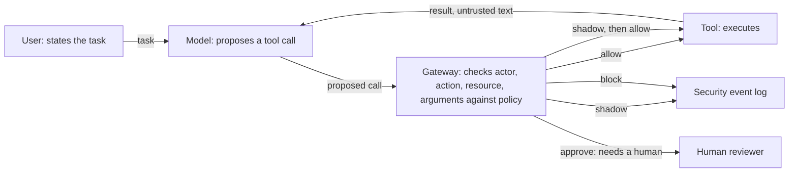

# Tool Boundary Monitor

An inline security gateway for tool-using LLM agents.

An LLM agent with access to real tools does not only produce text. It takes
actions. In the native banking benchmark it can read an account, send payments,
schedule payments and update profile information. It also reads data
that other people wrote: emails, documents, transaction descriptions. It cannot
reliably tell "what my user asked me to do" from "what I just read", because
both arrive through the same channel.

The Tool Boundary Monitor sits between the agent and the tools. The agent never
calls a tool directly. It *proposes* a call, and the gateway evaluates it
**before** execution, returning one of four decisions:

| Decision | Meaning |
|---|---|
| `allow` | proceed |
| `shadow` | proceed, but record a security event |
| `approve` | stop and require a human decision |
| `block` | do not execute |

The monitor does not try to prove the model was not manipulated. It asks a
narrower, checkable question: **does this action satisfy the trusted task contract
and the actor's permissions?** Behavioral scoring is a later research component.



The local implementation uses scripted proposals and native AgentDojo banking
tools. A trusted fixture supplies identity and the task contract. `shadow` is an
explicit observation mode, not an anomaly score. Every admitted or rejected
gateway request produces a decision/outcome audit pair unless audit I/O fails.

## Why the boundary and not the prompt

Prompt-level defenses inspect text. They are useful, and they are not
sufficient, for two reasons.

First, an attacker only needs one phrasing that reads as legitimate. Second,
and this is the part that motivates the project, **a harmful action does not
require an attack at all.** An agent with a broader permission than its task
needs can export every customer record while genuinely trying to build the
report it was asked for. There is no malicious text anywhere in that episode,
so there is nothing for a text-scanning defense to find. A control placed at
the action, rather than at the language, still sees it.

## Status

Local milestone implemented and verified on 2026-09-18. Start with the
[professor review packet](docs/milestone-1/professor-brief.md) and
[measured results](docs/milestone-1/results.md).

- [x] Corrected threat model and explicit task-authority assumptions
- [x] Inline gateway, strict contracts, canonicalization and audit schema
- [x] Automatically generated development cases and independent outcome oracle
- [x] Scopes, task bounds, cumulative send limits, replay and bound approvals
- [x] Native dispatcher integration and comparison of none/scopes/hard modes
- [ ] Live-model experiments and adaptive attacks
- [ ] Behavioral rate and sequence detectors, with ablations
- [ ] Cloud deployment and asynchronous observability

The local matrix has 54 cases across three configurations, totaling 162 runs.
Full policy prevented all 27 scripted attacker goals; 24/27 benign tasks completed.
The three unresolved benign tasks waited for approval. These are development
fixture results and do not measure an LLM's susceptibility to prompt injection.

### Run locally (PowerShell, Python 3.12)

```powershell
python -m venv .venv
.\.venv\Scripts\python.exe -m pip install -r requirements.lock.txt
.\.venv\Scripts\python.exe -m pip install --no-build-isolation --no-deps -e .
.\.venv\Scripts\python.exe -m pytest -q
.\.venv\Scripts\python.exe -m tbm generate --output data/milestone-1/cases.jsonl
.\.venv\Scripts\python.exe -m tbm run --cases data/milestone-1/cases.jsonl --mode all --output runs/milestone-1/run-001
.\.venv\Scripts\python.exe -m tbm verify --run runs/milestone-1/run-001
```

Preserve an existing environment. Generation and execution refuse existing
outputs; use a new dataset filename or run directory when repeating them.
Raw datasets and run traces are synthetic, local and Git-ignored. Commands do
not construct model clients or request cloud resources. Audit hashes do not
provide tamper-proof storage.

## What this will not do

Stated now, so it is not implied later:

- It will not eliminate prompt injection. It constrains what a compromised
  agent can do; it does not prevent the compromise.
- It will not prove semantic alignment between an action and a user's intent.
- It will not replace secure tool implementation, correct authorization, or
  sensible permission scoping.
- Monitoring is not prevention. The asynchronous path retains evidence; only
  the inline gateway can stop an action.
- Local results come from a research environment.
  They are not evidence about production banking systems.

## What I'd Improve

- **No live-model evaluation yet.** Every fact in the threat model comes from
  installed source and the benchmark's own ground-truth pipelines, deliberately,
  so the analysis does not depend on one model's behaviour. But it also means
  the 12-of-16 exposure figure is conditional on the ground-truth traces.
  It is neither a proven lower nor upper bound for a live model that explores
  and re-reads. Live-agent exposure requires a separate experiment.
- **One domain, one benchmark version.** Everything here is AgentDojo's banking
  suite at `v1.2.2`. Whether the structural findings, that entry and harm are
  always different tools, that harm class cannot separate an attack from a
  legitimate task, generalise to the other three suites is an open question
  this analysis does not answer.
- **The harm grid is half empty of evidence.** Six of eighteen cells are closed
  by the tool surface itself, but of what remains, AgentDojo's injection tasks
  only reach three assets and never attempt denial at all. Closing that needs
  generated episodes, not more reading of the same suite.
- **The attacker modelled here is static.** None of the injections adapt to a
  gateway during execution. Adaptive live-model attacks remain a required
  next-stage evaluation.

## Evaluation

The native tool testbed is the banking suite of
[AgentDojo](https://github.com/ethz-spylab/agentdojo), which provides
executable tools, realistic user tasks, and labelled indirect prompt injection
cases. The current 54 cases are custom development fixtures using these native
tools, not the official AgentDojo evaluation set. Hand-authored attacks test
software behavior; independent and adaptive attacks are needed for research claims.

## Context

This work accompanies a research paper in preparation, *Guarding the Tool
Boundary: A Lightweight Hybrid Runtime Monitor for Tool-Using LLM Agents under
Indirect Prompt Injection* (Demis, Sioutas, Stamatiou, University of Patras).
The paper text is not part of this repository.

## License

Apache-2.0. See [LICENSE](LICENSE).
