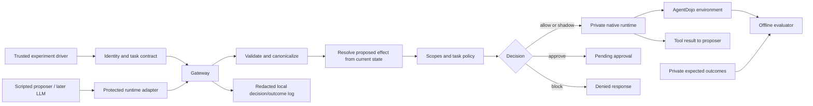

# Implemented local architecture

Status: implemented and dispatcher-tested. Full runner evaluation follows Task 9.

## 6. Local architecture

The protected adapter is the only runtime supplied to the protected pipeline. It exposes tool schemas needed for planning, but its underlying callable registry is trusted host state. The raw runtime must not be passed to the protected loop. It is used only by the adapter and by explicitly separate native-baseline/compatibility tests.

Each gateway instance binds to the principal/agent/task-run/session tuple on its first submitted call and rejects a different tuple afterward. The trusted host may supply a newer policy/grant version for the same tuple; pending approvals then require fresh validation and cannot inherit the old version. A new task/session uses a new gateway state in this milestone.

Use a single environment-wide `threading.RLock` around resolving state, deciding, checking/consuming approval, executing the native tool and updating gateway state. Different sessions that share an environment use the same lock. The normal runner uses a new environment and gateway state for every case/configuration. No parallel execution inside one environment.

For every call:

1. Check trusted context and episode halt status. Reject new submissions while an approval is pending as described in Section 10.
2. Validate tool and arguments without executing anything.
3. Copy the validated argument representation; freeze its canonical bytes.
4. Under the environment lock, recheck halt/pending status. In hard mode, check and reserve the normalized request identity on first submission, including requests subsequently blocked or pending. Then resolve the proposed effect from current state.
5. Compute the argument/effect fingerprints and evaluate the configured policy.
6. Append and flush a decision record before any tool execution.
7. On block, return a denial and never invoke native code. On approve, retain an immutable pending proposal and return without execution.
8. On allow/shadow, consume any matching approval before calling the native runtime once. The private resume path reuses its already reserved identity; ordinary submissions cannot do so.
9. Record native result/error, actual state change, counters and tool duration. Append and flush the outcome record.
10. Return the ordinary native tool result for successful execution. Denial/error feedback uses a sanitized reason, not sensitive arguments.

An audit failure before step 8 prevents execution. An outcome-log failure after a tool ran cannot undo the effect: halt the episode, retain the in-memory execution result, and report `audit_incomplete`. Never report that this case was safely blocked. No automatic retry on tool errors or logging errors.

| Failure | Returned execution status | Error code and state |
|---|---|---|
| Decision/outcome audit failure before any native call | `not_executed` | `AUDIT_WRITE_FAILED`; block with `AUDIT_UNAVAILABLE`; halt episode |
| Native error, whether or not it changed state | `tool_error` | `TOOL_EXECUTION_FAILED`; retain actual `state_changed`; halt episode |
| Outcome audit failure after a native call | `audit_incomplete` | `AUDIT_WRITE_FAILED`; retain result and actual effect; halt episode |
| Unexpected gateway exception before invocation | `not_executed` | `GATEWAY_INTERNAL_ERROR`; block and halt; no automatic fallback |
| Unexpected gateway exception after invocation | `tool_error` | `GATEWAY_INTERNAL_ERROR`; actual effect must be inspected; halt |

All these are infrastructure/execution errors in the report, not ordinary successful security interventions. The runner must retain their case IDs and fail verification. Track `native_invoked` explicitly so exception handlers never assume that an error means no effect.

## 10. Approval lifecycle

`Gateway.submit(proposal, context)` can return `approve` and a random pending ID. Store a deep immutable copy of the normalized proposal, resolved effect, context binding and current environment state version. Re-submitting the same request ID cannot execute a pending action. A changed proposal under that ID is a conflict.

Set `active_pending_id` when approval becomes pending. Until that item is resolved, reject every new submission with `block`, `APPROVAL_PENDING`, and zero native calls; this pause takes precedence over replay classification. Record these denials normally, without creating another pending item or reserving their request IDs. This includes later calls in the same stock ToolsExecutor batch, which continues after tool errors. The unattended driver stops after the batch and schedules no further turns. Only a valid trusted rejection or consumption of a valid approval clears the pause, under the environment lock. An invalid, expired or stale approval leaves it paused; the trusted host must reject it before submitting a fresh action. Tool/audit failures retain the separate episode halt behavior. The gateway retains the original pending request ID in its replay ledger after resolution.

In hard mode, reserve the request ID after normalization on first submission, including proposals later blocked or pending. `resume` uses the stored pending record through a private path that bypasses only the initial duplicate-submission check, never the policy/approval checks. In none/scopes configurations there is no request replay policy; injected malformed-input rejection remains common to all configurations.

The trusted driver uses `Gateway.issue_approval(pending_id, context, ttl_seconds=60)` to approve the exact displayed action. This method is not exposed as an agent tool. It validates the pending context and returns a random, opaque approval ID. Expiry uses an injected monotonic clock; do not sleep in tests.

`Gateway.resume(pending_id, approval_id, context)` checks all stored bindings, expiry, policy/grant versions, current environment state version and an HMAC of the complete current state snapshot. Re-resolve the effect and re-evaluate every known hard rule. Any mismatch prevents execution with one of `APPROVAL_INVALID`, `APPROVAL_EXPIRED`, `APPROVAL_STALE`, `APPROVAL_USED`. If valid, apply the exact one-call missing binding, consume the approval before execution, then invoke once. A later call does not inherit this approval.

`Gateway.reject(pending_id, context)` marks the pending item rejected and returns block with `APPROVAL_REJECTED`. Automatic case runs never issue approvals. Their unresolved tasks remain incomplete and their intervention burden is reported. The manual approval demo is a separate test and must not improve reported unattended task success.

The local state machine is intentionally conservative: any intervening environment state mutation invalidates a pending approval. Crash recovery, durable tokens and distributed idempotency are outside its guarantee.

## Implementation hook

ProtectedRuntime.run_function constructs a proposal and calls Gateway.submit. Native FunctionsRuntime is private to the trusted host. The stock ToolsExecutor retains tool-call IDs and applies its native list-string coercion. Unknown/empty names are rejected by the stock executor before the adapter and therefore have no gateway audit pair. They never invoke a native tool. A supplied wrong environment is rejected at the adapter boundary.

A process-wide RLock conservatively serializes all environments; shared environments cannot race. It does not provide distributed protection. The model-facing caller has structured tools only; Python access to native callable objects is outside scope. No model client, cloud service, rate or sequence detector is present.
