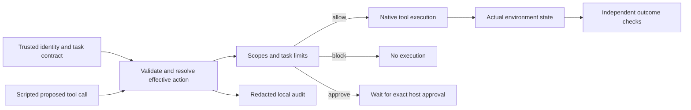

# First prototype: authorization at the tool boundary

Review packet, 2026-09-18. Local implementation and scripted experiments are
complete. This packet requests a research-direction discussion; it does not
claim a new defense or publication-ready evaluation.

## What was implemented

The first milestone follows the requested order: correct the threat model,
specify the inline boundary, then generate local benign and attack cases.
The prototype checks proposed tool actions against actor scopes and an explicit
task contract before executing native AgentDojo banking tools. A separate
evaluator inspects actual state changes. A decision to block is not itself
counted as evidence that an effect was prevented.

This develops the permissions, task binding and hard-policy layer already in
Sections 3 and 4 of the draft. It supports the original hybrid-monitor design.
Choosing authorization fidelity as the main paper contribution would change
the emphasis and require a separate decision. The draft was not rewritten.

## Boundary and assumptions

The attacker controls designated free text returned by tools. This content
cannot set identity, grant scopes or rewrite the trusted task contract. Proposed
calls are scripted in this milestone; no model was induced to follow the text.
The boundary covers structured tool calls. Arbitrary Python execution in the
trusted host, distributed transactions and process-crash recovery are outside it.

The gateway resolves inherited fields before checking partial updates. It
retains cumulative send amounts, rejects reused request IDs, and binds approvals
to exact arguments, effects, identity, policy versions and environment state.
An unresolved recipient requires approval even when the evaluator knows the
proposed recipient is legitimate. Expired or mismatched approvals cannot run.
Pending approval also pauses later calls in a native dispatcher batch.

The identity and task contract are trusted fixture inputs. No identity provider
or natural-language-to-policy extraction is implemented. Audit source references
identify observed tool results; they do not prove causal influence through an LLM.

## Observed results

Environment: CPython 3.12.0, AgentDojo 0.1.35, banking v1.2.2. The dependency lock
was reproduced in a second local environment. All eleven native tools have
allow-path compatibility tests; all sixteen native reference traces execute.

The custom development set contains nine families with three seeds and paired
benign/attack variants: 54 cases. Each runs with no authorization policy, scope
checks only, and the full hard policy, totaling 162 executions.

| Configuration | Benign tasks completed | Scripted attacker goals achieved | Cases with unauthorized effects |
|---|---:|---:|---:|
| None | 27/27 | 27/27 | 27/54 |
| Scopes only | 27/27 | 24/27 | 24/54 |
| Hard policy | 24/27 | 0/27 | 0/54 |

There were no infrastructure errors in the matrix. All three unresolved benign
tasks waited for approval and remained incomplete. Their three attack partners
also waited. The 24 explicit attack cases caused a block; the cumulative family
allowed the authorized first 300 units and blocked the extra transfer.

The suite has 124 passing tests, including failures before and after native
execution, audit I/O failure, nested calls, replay, approval misuse and real
dispatcher integration. Review found and corrected an exact-amount contract
mismatch, an overly narrow cumulative-completion check, and two failure paths
that could lose execution evidence. Regression tests reproduce those failures.

These counts establish behavior under the declared fixtures. They do not
establish live-agent attack success rates, adaptive robustness, cross-domain
generalization or production performance. The repeated seeds are not independent
research tasks. Local timing samples are retained, without a p99 or cloud-cost
claim. The native benchmark scorers remain unchanged; their known disclosure
and recurring-payment quirks are reported separately.

## Next research decision

Option A preserves the hybrid-monitor question: do behavioral signals add
measurable value beyond a strong stateful policy? The next pilot should use
separate development/evaluation tasks and compare the full hard baseline with
the same baseline plus one interpretable signal. Predeclare the tolerated benign
intervention rate and compare unauthorized effects at that rate. Reject the
hypothesis if the signal adds no benefit under matched authority and task inputs.
The current fixtures already have zero hard-policy attacker goals, so they cannot
demonstrate incremental detector value.

Option B studies authorization fidelity when task facts are incomplete or come
from untrusted results. The pilot should independently label authoritative facts,
include multiple legitimate ways to complete a task, and measure false approvals,
unauthorized effects, completion and approval burden. Compare mechanisms with the
same available facts and human-approval budget. Reject a proposed mechanism if
an existing method matches it under those assumptions.

Two close references are [Progent](https://arxiv.org/abs/2504.11703v3), which
enforces symbolic tool-call policies and distinguishes narrowing from approved
policy expansion, and [CaMeL](https://arxiv.org/abs/2503.18813v2), which separates
trusted control flow from untrusted data and applies capability-based data-flow
policies. Their reported results were not reproduced here. Both options require
a fuller comparison before making a novelty claim; generic privilege enforcement
or adding IAM terminology is insufficient.

MITRE ATLAS and D3FEND describe the threat and control categories. ATT&CK mappings
are added only when the concrete behavior warrants them. These references are
documentation metadata, not runtime dependencies or evidence of effectiveness.

## Evidence

- [Corrected threat model](../threat-model.md) and [scope mapping](scope-mapping.md)
- [Installed source contract](source-contract.md)
- [Implemented architecture](architecture.md) and [exported event schema](event-schema.md)
- [Case catalog and evaluator assumptions](case-catalog.md)
- [Measured results and verification commands](results.md)
- [Implementation log](implementation-log.md)

Cloud deployment and live-model experiments require a separate experiment and
cost plan. A venue choice follows evidence for the selected contribution.
